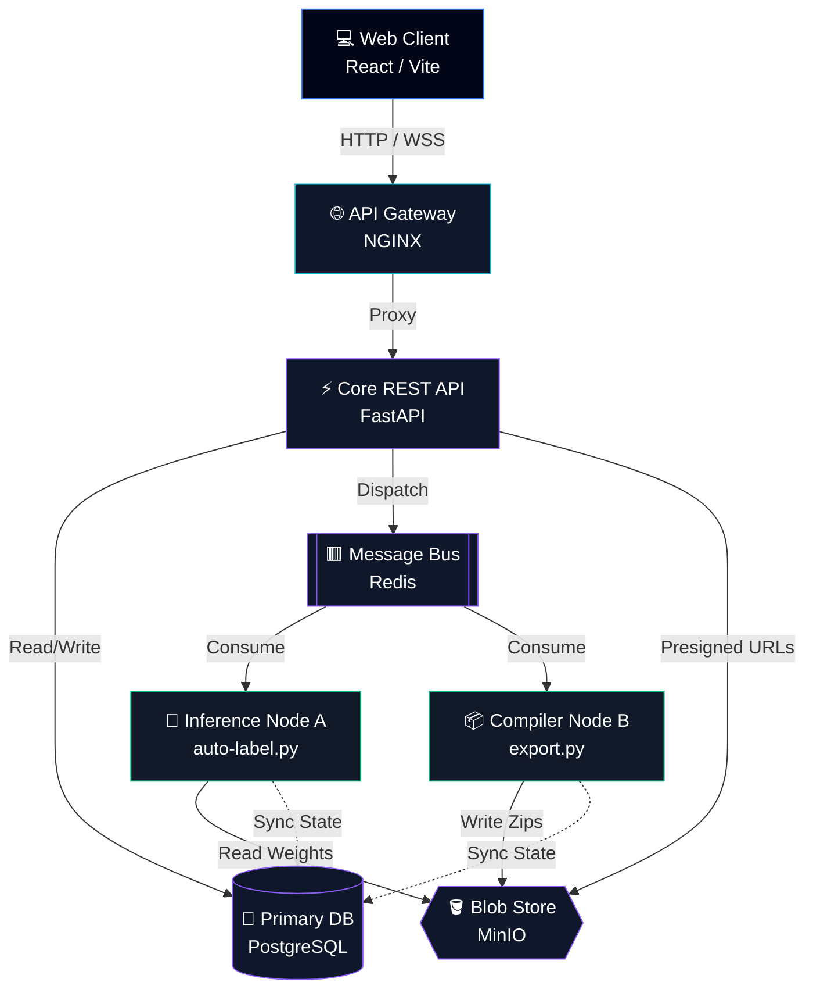

<div align="center">

<!-- Modern Minimalist Header -->

 


<br/><br/>

<h1 align="center" style="border-bottom: none; margin-bottom: 0;"><strong>[ PIXEL :: QUEUE ]</strong></h1>
<p align="center" style="font-family: monospace; color: #8B5CF6; letter-spacing: 0.1em; font-size: 14px;">VISION INTELLIGENCE INFRASTRUCTURE</p>

<a href="https://git.io/typing-svg">
  
</a>

<p align="center">
  <em>A high-performance, dark-themed control panel for human-in-the-loop AI annotation, powered by decoupled ML microservices and robust task queues.</em>
</p>

<p align="center">
  
  
  
  
  
  <a href="https://deepwiki.com/DhruvGarg111/PixelQueue"></a>
</p>

<p align="center">
  <a href="#-core-architecture"><b>Architecture</b></a> &nbsp;&bull;&nbsp;
  <a href="#-infrastructure-setup"><b>Setup</b></a> &nbsp;&bull;&nbsp;
  <a href="#-feature-matrix"><b>Features</b></a> &nbsp;&bull;&nbsp;
  <a href="#-ml-operations"><b>MLOps</b></a>
</p>

</div>

---

## ⚡ Feature Matrix

PixelQueue embraces a strictly minimal, tech-forward aesthetic. It removes UX bottlenecks with pure speed, ditching heavy animations for instantaneous, DOM-optimized rendering.

| Capability | Module | Description |
| :--- | :--- | :--- |
| **Role-Based RBAC** | `Auth` | First-party register/login with secure cookie sessions, plus project-level `admin`, `reviewer`, and `annotator` roles. |
| **Asynchronous ML** | `Celery Worker` | Non-blocking AI auto-labeling via PyTorch & Ultralytics integrations (YOLO/SAM). |
| **Human-in-the-Loop** | `Review Queue` | Imperative approval circuits. QA pipelines ensure 100% ground-truth validity. |
| **Format Compilers** | `Export Engine` | Distills annotation geometry into normalized `COCO JSON` and `YOLO txt` structures in seconds. |
| **Zero-Latency UI** | `Canvas Renderer` | Hardware-accelerated React-Konva staging. Zero-bloat OLED-optimized dark interface. |

<br/>

## 🏗️ Core Architecture

A highly decoupled, event-driven topology. The monolithic backend worker has been strictly partitioned into localized domains (`tasks/`, `converters/`) allowing infinite horizontal scaling of inference nodes.



<br/>

## 🚀 Infrastructure Setup

Bootstrapping the entire constellation of microservices requires only Docker.

> [!IMPORTANT]
> Ensure ports `8000`, `5173`, `9000`, and `5432` are open on your host machine.

```bash
# 1. Clone & initialize environment
git clone https://github.com/DhruvGarg111/PixelQueue.git
cd PixelQueue
cp .env.example .env

# 2. Compile and detatch all containers
docker compose up -d --build

# 3. Inject initial DB schemas, required buckets, and root users
docker compose --profile tools run --rm bootstrap
```

### 📡 Telemetry & Access

| Intranet Target | Port Bind | Responsibility |
| :--- | :--- | :--- |
| **Control Panel UI** | `localhost:5173` | The primary frontend interface. |
| **API Swagger Docs** | `localhost:8000/docs` | Live OpenAPI schema for integration testing. |
| **MinIO Console** | `localhost:9001` | S3-compatible bucket explorer. |

<br/>

## 👤 RBAC Personas

Running the bootstrap script automatically provisions three demo profiles for local development and test workflows. Production onboarding is now self-serve through the register flow in the app.

| Rank | Identifier | System Key (Pass) | Capabilities |
| :--- | :--- | :--- | :--- |
| `[ADMIN]` | `admin@example.com` | `admin123` | Global R/W. Cross-project administration, user assignment, pipeline triggering. |
| `[REVIEWER]` | `reviewer@example.com` | `reviewer123` | Queue isolation. Finalize or reject annotation tasks. |
| `[ANNOTATOR]`| `annotator@example.com` | `annotator123` | Self-serve project creation, canvas interaction, and ML-assisted annotation. |

<br/>

## 🧠 ML Operations

Located within the `/scripts` directory, an endogenous MLOps suite acts as the bridge between annotated data and deployment realities.

```bash
# 1. Sync & format remote datasets to local tensor inputs
python scripts/prepare_dataset.py

# 2. Execute GPU-accelerated YOLO bounds training
python scripts/train_yolo.py

# 3. Assess confidence vs. IOU against holdout splits
python scripts/evaluate.py

# 4. Serialize weights into the production registry
python scripts/register_model.py
```
