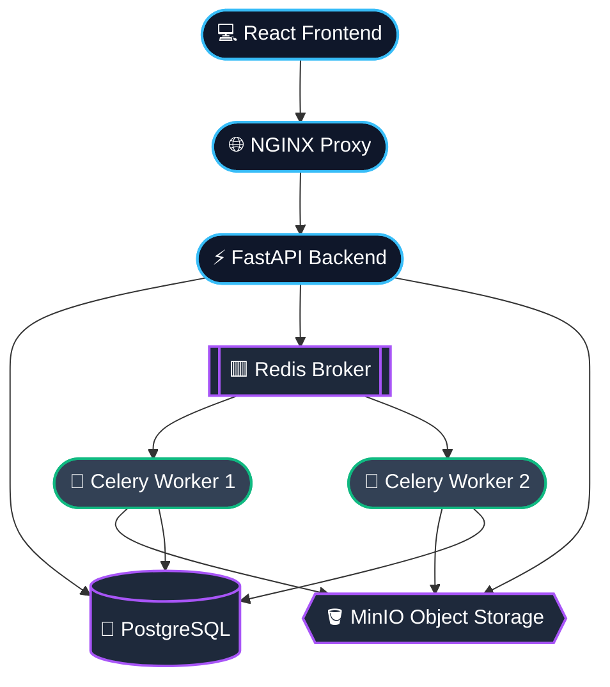

<!-- 
  Modern, Next-Level README
  Custom-designed for a professional AI Annotation Platform
-->
<div align="center">

 


<br/><br/>

<h1>🔳 Pixel Queue</h1>

<a href="https://git.io/typing-svg">
  
</a>

<p align="center">
  <em>A state-of-the-art vision intelligence platform powered by seamless collaboration, AI-driven workflows, and robust observability.</em>
</p>

<p align="center">
  
  
  
</p>

<br/>

**[🚀 Quick Start](#-quick-start)** &nbsp;&bull;&nbsp;
**[✨ Features](#-features)** &nbsp;&bull;&nbsp;
**[🏗️ Architecture](#-architecture)** &nbsp;&bull;&nbsp;
**[⚙️ API](#-api-reference)** &nbsp;&bull;&nbsp;
**[🧠 ML Pipeline](#-ml-training-pipeline)**

</div>

---

## ✨ Features

We engineered the platform to eliminate bottlenecks in creating high-quality computer vision datasets.

<table width="100%">
  <tr>
    <td width="50%">
      <h3 align="center">👥 Role-Based Collaboration</h3>
      <p align="center">Secure workspaces categorized by <code>annotator</code>, <code>reviewer</code>, and <code>admin</code> roles. Streamlined pipelines ensure quality control and accountability across globally distributed teams.</p>
    </td>
    <td width="50%">
      <h3 align="center">🤖 AI Auto-Labeling</h3>
      <p align="center">Accelerate your workflow by deploying ML models (YOLO, Segment-Anything) via Celery background jobs to generate foundational annotations in seconds.</p>
    </td>
  </tr>
  <tr>
    <td width="50%">
      <h3 align="center">🔁 Human-in-the-Loop</h3>
      <p align="center">Dedicated review queues. Annotations undergo rigorous approval checks with iterative feedback loops, ensuring zero-defect datasets.</p>
    </td>
    <td width="50%">
      <h3 align="center">📦 Lightning Fast Exports</h3>
      <p align="center">One-click asynchronous dataset generation. Instantly compile all approved imagery and annotations into industry-standard <strong>COCO</strong> and <strong>YOLO</strong> formats.</p>
    </td>
  </tr>
</table>

<br/>

## 🚀 Quick Start

Launch the entire ecosystem directly via Docker Compose.

> [!NOTE] 
> Ensure Docker and Docker Compose are installed on your system before proceeding.

```powershell
# 1. Initialize environment variables
Copy-Item .env.example .env

# 2. Build and orchestrate all microservices
docker compose up --build -d

# 3. Bootstrap initial database state (users, project, test model)
docker compose --profile tools run --rm bootstrap
```

### 🌐 Service Access Points

All services are instantly proxy-routed and globally accessible from your local machine:

| Service | Endpoint | Role / Description |
| :--- | :--- | :--- |
| **Frontend UI** | [http://localhost:5173](http://localhost:5173) | Primary client interface built on React & Vite |
| **API Swagger** | [http://localhost:8000/docs](http://localhost:8000/docs) | Interactive OpenAPI specs for the FastAPI backend |
| **MinIO Console**| [http://localhost:9001](http://localhost:9001) | S3-compatible Object Storage management |
| **Flower** | [http://localhost:5555](http://localhost:5555) | Celery task & worker monitoring dashboard |
| **Prometheus** | [http://localhost:9090](http://localhost:9090) | System-level metric aggregation & tracking |

<br/>

## 🏗️ Architecture Stack

The platform is designed around a microservice architecture, allowing independent scaling of the worker layer for heavy deep-learning workloads.



### 🔄 Core Lifecycle
1. **Import** &rarr; Image uploaded via presigned S3 URLs, task set to `open`.
2. **Annotate** &rarr; Manual polygon/box drawing or AI Auto-Label requested (`in_progress`).
3. **Submit** &rarr; Task sent for administrative or QA review (`in_review`).
4. **Evaluate** &rarr; Reviewer accepts or rejects with localized feedback.
5. **Finalize** &rarr; Task locked (`done`).
6. **Export** &rarr; Extracted incrementally via background job into COCO/YOLO archives.

<br/>

## 🔰 First-Run Roles & Workflow

By running the bootstrap script, your environment receives default users representing the entire organizational structure.

| Persona | Sign-in Email | Password | Allowed Actions |
| :--- | :--- | :--- | :--- |
| **Administrator** | `admin@example.com` | `admin123` | Create projects, manage users, initialize exports, full data access. |
| **Reviewer** | `reviewer@example.com` | `reviewer123` | Accept/Reject tasks in the review queue, view metrics. |
| **Annotator**| `annotator@example.com` | `annotator123` | Claim tasks, draw bounding boxes/masks, trigger auto-label. |

<br/>

## ⚙️ API Reference

A highly optimized RESTful interface serving the React client. _(*Base URL default: `http://localhost:8000`)*_

* **Identity:** `POST /api/v1/auth/login` | `GET /api/v1/me`
* **Workspaces:** `POST /api/v1/projects` | `GET /api/v1/projects/{id}`
* **Storage:** `POST /api/v1/projects/{id}/images/presign-upload`
* **Inference:** `POST /api/v1/images/{id}/auto-label` (Dispatches ML Task)
* **Pipelines:** `POST /api/v1/projects/{id}/exports` (Dispatches Archival Task)

<br/>

## 🧠 ML Training Pipeline

The repository ships with an endogenous, decoupled MLOps suite (located in `scripts/`), allowing data scientists to transition seamlessly from annotation to model deployment.

```bash
# 1. Prepare and segment the requested dataset configuration
python scripts/prepare_dataset.py

# 2. Invoke Ultralytics YOLOv8 native training
python scripts/train_yolo.py

# 3. Assess model weights against validation subsets
python scripts/evaluate.py

# 4. Push validated weights to model registry
python scripts/register_model.py
```

<br/>

## 🔧 Troubleshooting & Support

> **Empty Annotate Queue / "No available tasks"**
> If you are an annotator and see no tasks, either you have not been assigned to the active project, or all tasks have progressed out of the `open` state.

> **Exports stuck in pending or failed**
> Inspect the worker container directly: `docker compose logs -f worker`. Validate that Redis is acknowledging task execution and MinIO access keys are synchronized in the `.env`.

> **MinIO Presigned Images returning 403 or Infinite Loading**
> Verify your `.env` contains `MINIO_PUBLIC_ENDPOINT=localhost:9000` (for local development). The browser requires this direct endpoint path rather than internal docker DNS to resolve images.

<div align="center">
<br/>
<hr/>
<i>Architected for the future of collaborative vision intelligence.</i>
</div>
