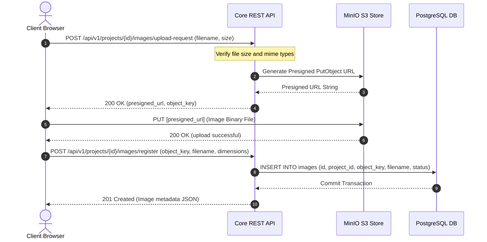
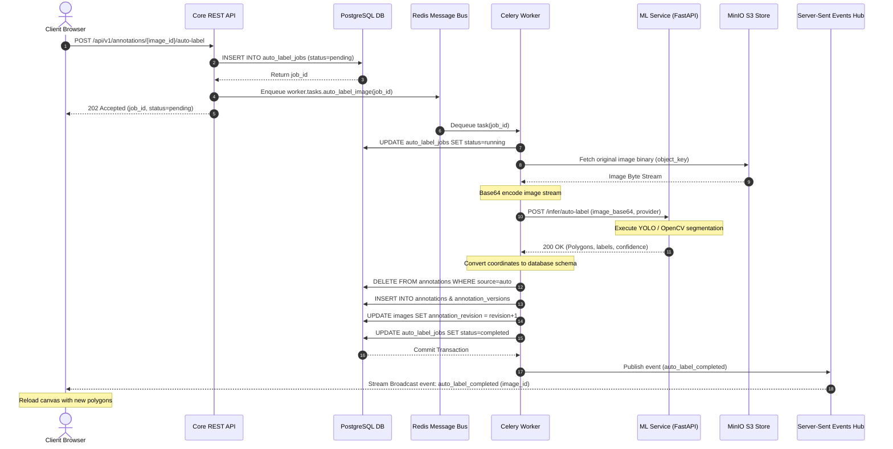
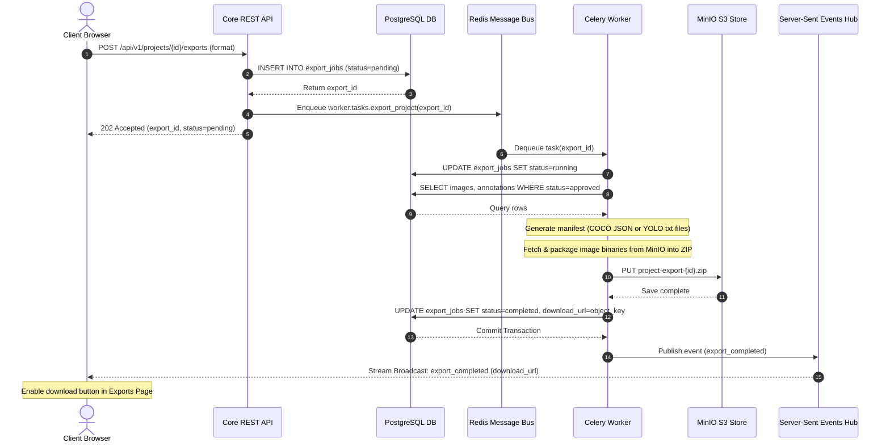

# Data Flow Sequences

This document provides detailed sequence diagrams and explanations for the three core workflows within PixelQueue:
1. **Image Upload & Ingestion** (Synchronous API + Direct S3 Upload)
2. **Asynchronous Auto-Labeling** (Celery Task + ML Service inference + SSE broadcast)
3. **Asynchronous Dataset Export** (Celery Task + coordinate conversion + ZIP compression)

---

## 1. Image Upload & Ingestion Flow

PixelQueue uses direct client-to-storage uploads via S3 pre-signed URLs to bypass the API server for binary files, preventing memory bloat and preserving bandwidth.

### Detailed Sequence
1. **Upload Request**: The browser requests a write link from `api` specifying the name and size of the file.
2. **Presigning**: The backend verifies details (max 20MB, image MIME type) and requests a pre-signed PUT URL from the S3 client wrapper (`minio_client.py`).
3. **Transmission to Browser**: The URL and unique S3 object key (e.g. `projects/{uuid}/images/{uuid}.png`) are returned.
4. **Direct Object Put**: The browser executes a PUT request containing the raw file binary directly to the `minio` service, bypassing the backend.
5. **Registration**: Once the binary is stored, the browser calls the registration endpoint to create the record in `postgres`, finalizing the image's database state.

---

## 2. Asynchronous Auto-Labeling Sequence

Auto-labeling uses PyTorch-based segmentation models. Because ML inference is computationally heavy, it is run asynchronously through Celery task queues.

### Detailed Sequence
1. **Trigger**: Clicking "Auto-Label" sends a POST request. The API immediately inserts a job record, dispatches a task to `redis`, and returns a `202 Accepted` status with a `job_id` so the client UI does not hang.
2. **Task Ingestion**: A `worker` dequeues the task and transitions the job state to `running`.
3. **Data Retrieval**: The worker downloads the source image from `minio` in-memory.
4. **Inference Request**: The worker base64 encodes the file bytes and posts it to the internal `/infer/auto-label` endpoint hosted on the isolated `ml-service` container.
5. **DB Update**: The worker deletes any previous auto-label mocks, bulk-inserts the predictions as JSONB boundaries (`geometry_jsonb`), increments the revision counter, and sets the task's state to complete.
6. **Real-time Notify**: The worker invokes `publish_project_event` which writes to the SSE queue. The SSE connection transmits an `auto_label_completed` message. The client receives the payload and instructs the Konva stage to fetch and render the new polygons.

---

## 3. Asynchronous Dataset Export Flow

Export tasks query project records, run coordinate compilation, compress images + meta, and save the resulting files to S3.

### Detailed Sequence
1. **Trigger**: An admin initiates an export in a chosen format (`coco_json` or `yolo_txt`).
2. **Queuing**: The API registers a database tracking record, sends the task details to `redis`, and hands back a tracking payload to the client.
3. **Compilation**: The worker fetches all database annotations validated as `approved` (ground-truth only).
4. **Formatting**: In-memory, the converter modules translate the DB polygon structure into either standard COCO JSON schemas or normalized YOLO bounding box text files.
5. **Storage**: The package writes these text assets, fetches original images from MinIO, packages them into a single ZIP archive, and uploads it to MinIO.
6. **Delivery**: The job is marked as complete. The SSE listener notifies the user, exposing a link that requests a pre-signed GET URL to download the archive directly from S3.
