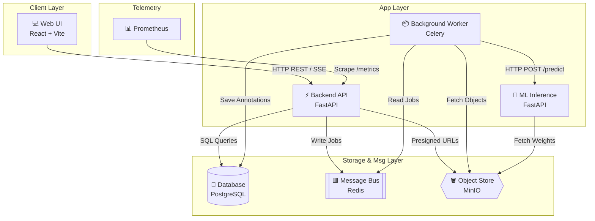

# System Architecture Overview

PixelQueue is a human-in-the-loop AI image annotation platform designed for decoupled, scalable vision datasets construction. This document outlines the high-level system topology, the roles of each service, and the network communication protocols connecting them.

---

## 🏗️ System Topology

The system comprises 4 application services and 3 infrastructure services orchestrated via Docker Compose.



---

## 📡 Service Roles & Matrix

The following table documents the responsibilities and communication protocols used across the PixelQueue system:

| Service | Internal Hostname | Port | Communication Protocol | Authentication | Responsibility |
|---|---|---|---|---|---|
| **Frontend** | `frontend` | `5173` | HTTP (Web browser client) | Public | Renders the annotation canvas, project dashboards, and review queue interface. |
| **Backend API** | `api` | `8000` | HTTP REST / SSE | Secure cookie-based session | Handles user registrations, project CRUD, uploads processing, and SSE events dispatching. |
| **ML Service** | `ml-service` | `8002` | HTTP REST | Internal networking | Hosts YOLOv8-segmentation and OpenCV models for zero-latency inference. |
| **Worker** | `worker` | — | Redis Pub/Sub | Internal | Processes asynchronous Celery tasks (Auto-labeling, Dataset format compilation). |
| **PostgreSQL** | `postgres` | `5432` | PostgreSQL wire | DB Credentials (`POSTGRES_USER`) | Persists relational entities: users, projects, images, annotations, and system audit logs. |
| **Redis** | `redis` | `6379` | Redis protocol | Redis connection DSN | Message broker for Celery tasks and event-based queue management. |
| **MinIO** | `minio` | `9000` / `9001` | S3 API / HTTP | AWS Access & Secret keys | S3-compatible object store hosting original images, segmentation weights, and export archives. |
| **Prometheus** | `prometheus` | `9090` | HTTP Scrape | Bearer token (`METRICS_TOKEN`) | Scrapes and aggregates server statistics from the API telemetry endpoint. |

---

## 🔄 Core Lifecycle Narrative

The flow of data and execution through the services follows this structured lifecycle:

```
[Upload] ──────> [Auto-Label] ──────> [Fine-Tune] ──────> [QA Review] ──────> [Export]
```

### 1. Image Ingestion (Upload)
A user uploads an image. The Frontend requests a pre-signed S3 URL from the Backend API (`api`), uploads the image directly to the Object Store (`minio`), and registers the image record in the database (`postgres`).

### 2. Machine-Assisted Ingestion (Auto-Label)
Once uploaded, the user clicks "Auto-Label". The API publishes an `auto_label` task payload containing the image object key to the Message Bus (`redis`). The Celery Worker (`worker`) picks up the task, calls the ML Service (`ml-service`) to perform boundary segmentation, converts the model outputs to GeoJSON format, saves the annotations to the Database, and broadcasts a progress update to the client via Server-Sent Events (SSE).

### 3. Human-in-the-Loop Refinement (Fine-Tune)
An annotator logs in, loads the annotation workspace, and views the pre-segmented boundaries. Using the KonvaJS canvas tools, they manually resize, move, or add vertices to fine-tune the polygons to 100% precision. The updates are saved back to the database via REST requests.

### 4. Quality Assurance (Review Queue)
Once completed, the annotator submits the task. The image enters the QA Review Queue. A user with the `reviewer` or `admin` role loads the image, inspects the segmentations, and either approves the task (marking it as ground-truth) or rejects it (returning it to the annotator with notes).

### 5. Compiled Dataset Export
Once all images in a project are approved, the user triggers a project export. The API queues a Celery compiler task. The Worker fetches the project’s annotations from the DB, translates their coordinates to either COCO JSON or YOLO txt formats, packages them along with the original images into a ZIP archive, uploads the archive to MinIO, and sends the download link to the frontend via SSE.
