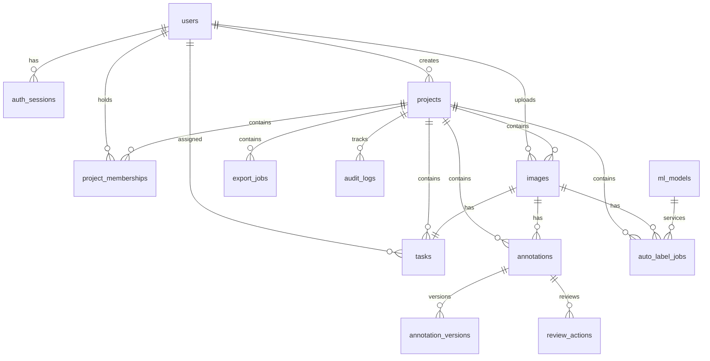

# Database Models & Schema Reference

PixelQueue uses PostgreSQL as its primary relational database. This document serves as the schema reference, detailing tables, fields, constraints, and entity relationships.

---

## 📊 Entity Relationship Diagram (ERD)

The following diagram illustrates how tables are related inside the database. Most tables use UUID keys and have cascaded deletes tied to their parent `projects` or `images`.

---

## 🗂️ Tables Reference

### 1. `users`
Stores user profile credentials and global administration roles.
*   **Unique Constraints**: `email`, `provider_subject`.
*   **Columns**:
    *   `id` (`UUID`, PK): Unique identifier.
    *   `email` (`VARCHAR(255)`, Not Null): Normalised email address.
    *   `password_hash` (`VARCHAR(255)`, Null): Cryptographic password hash (null for OAuth-registered users).
    *   `auth_provider` (`ENUM`, Default: `local`): Auth provider (`local`, `google`).
    *   `provider_subject` (`VARCHAR(255)`, Null): External identifier returned by the identity provider.
    *   `full_name` (`VARCHAR(255)`, Not Null): Display name.
    *   `global_role` (`ENUM`, Default: `annotator`): Global permissions level (`annotator`, `reviewer`, `admin`).
    *   `created_at` (`TIMESTAMPTZ`, Default: `now()`): Creation timestamp.

### 2. `auth_sessions`
Tracks active user login sessions and handles JWT refresh tokens.
*   **Foreign Keys**: `user_id` links to `users.id` (ON DELETE CASCADE).
*   **Columns**:
    *   `id` (`UUID`, PK): Unique session ID.
    *   `user_id` (`UUID`, Not Null): Owner ID.
    *   `refresh_token_hash` (`VARCHAR(128)`, Not Null): Cryptographic hash of the refresh token.
    *   `expires_at` (`TIMESTAMPTZ`, Not Null): Token expiration deadline.
    *   `revoked_at` (`TIMESTAMPTZ`, Null): Timestamp indicating when the session was manually logged out.
    *   `last_used_at` (`TIMESTAMPTZ`, Null): Last activity timestamp.
    *   `created_at` (`TIMESTAMPTZ`, Default: `now()`): Creation timestamp.

### 3. `projects`
Tracks groups of images and annotations.
*   **Foreign Keys**: `created_by` links to `users.id` (ON DELETE RESTRICT).
*   **Columns**:
    *   `id` (`UUID`, PK): Unique project ID.
    *   `name` (`VARCHAR(255)`, Not Null): Display name.
    *   `description` (`TEXT`, Null): Project description.
    *   `created_by` (`UUID`, Not Null): Administrator ID.
    *   `created_at` (`TIMESTAMPTZ`, Default: `now()`): Creation timestamp.

### 4. `project_memberships`
Maps users to projects and grants them project-specific access roles.
*   **Unique Constraints**: `(user_id, project_id)`.
*   **Foreign Keys**:
    *   `user_id` links to `users.id` (ON DELETE CASCADE).
    *   `project_id` links to `projects.id` (ON DELETE CASCADE).
*   **Columns**:
    *   `id` (`UUID`, PK): Unique membership ID.
    *   `user_id` (`UUID`, Not Null): Enrolled user.
    *   `project_id` (`UUID`, Not Null): Associated project.
    *   `role` (`ENUM`, Not Null): Access level (`annotator`, `reviewer`, `admin`).
    *   `created_at` (`TIMESTAMPTZ`, Default: `now()`): Enrollment timestamp.

### 5. `images`
Stores metadata and object keys for uploaded images.
*   **Foreign Keys**:
    *   `project_id` links to `projects.id` (ON DELETE CASCADE).
    *   `uploaded_by` links to `users.id` (ON DELETE RESTRICT).
*   **Columns**:
    *   `id` (`UUID`, PK): Unique image ID.
    *   `project_id` (`UUID`, Not Null): Parent project.
    *   `object_key` (`VARCHAR(512)`, Not Null): MinIO object path key.
    *   `width` (`INTEGER`, Not Null): Original image width.
    *   `height` (`INTEGER`, Not Null): Original image height.
    *   `checksum` (`VARCHAR(128)`, Null): File checksum verification.
    *   `annotation_revision` (`INTEGER`, Default: `0`): Monotonically increasing revision counter used for optimistic locking.
    *   `uploaded_by` (`UUID`, Not Null): Uploader user ID.
    *   `created_at` (`TIMESTAMPTZ`, Default: `now()`): Creation timestamp.

### 6. `tasks`
Orchestrates the workflow and assignment of individual images.
*   **Foreign Keys**:
    *   `project_id` links to `projects.id` (ON DELETE CASCADE).
    *   `image_id` links to `images.id` (ON DELETE CASCADE).
    *   `assigned_to` links to `users.id` (ON DELETE SET NULL).
*   **Columns**:
    *   `id` (`UUID`, PK): Unique task ID.
    *   `project_id` (`UUID`, Not Null): Parent project.
    *   `image_id` (`UUID`, Not Null): Target image.
    *   `status` (`ENUM`, Default: `open`): Workflow status (`open`, `in_progress`, `in_review`, `done`).
    *   `assigned_to` (`UUID`, Null): Currently assigned annotator.
    *   `due_at` (`TIMESTAMPTZ`, Null): Due date deadline.
    *   `created_at` (`TIMESTAMPTZ`, Default: `now()`): Creation timestamp.
    *   `updated_at` (`TIMESTAMPTZ`, Default: `now()`, Auto-update): Last modification timestamp.

### 7. `annotations`
Stores active segmentation geometry and labels.
*   **Foreign Keys**:
    *   `project_id` links to `projects.id` (ON DELETE CASCADE).
    *   `image_id` links to `images.id` (ON DELETE CASCADE).
    *   `created_by` / `updated_by` link to `users.id` (ON DELETE RESTRICT).
*   **Columns**:
    *   `id` (`UUID`, PK): Unique annotation ID.
    *   `project_id` (`UUID`, Not Null): Parent project.
    *   `image_id` (`UUID`, Not Null): Associated image.
    *   `label` (`VARCHAR(255)`, Not Null): Category label.
    *   `geometry_jsonb` (`JSONB`, Not Null): GeoJSON representation.
    *   `source` (`ENUM`, Not Null): Annotation source (`manual`, `auto`).
    *   `status` (`ENUM`, Default: `draft`): Status (`draft`, `approved`, `rejected`).
    *   `confidence` (`FLOAT`, Null): Model confidence (null for manual annotations).
    *   `revision` (`INTEGER`, Not Null): Active revision index matching the parent image.
    *   `created_at` / `updated_at` (`TIMESTAMPTZ`): Timestamps.

### 8. `annotation_versions`
Archives historical geometry states to support audit logging and revert operations.
*   **Foreign Keys**: `annotation_id` links to `annotations.id` (ON DELETE CASCADE).
*   **Columns**:
    *   `id` (`UUID`, PK): Unique version ID.
    *   `annotation_id` (`UUID`, Not Null): Parent annotation ID.
    *   `revision` (`INTEGER`, Not Null): Revision index of this version.
    *   `geometry_jsonb` (`JSONB`, Not Null): Geometry state at this revision.
    *   `label` (`VARCHAR(255)`, Not Null): Label state.
    *   `source` (`ENUM`, Not Null): Source state.
    *   `status` (`ENUM`, Not Null): Review status state.
    *   `changed_by` (`UUID`, Not Null): User who performed the change.
    *   `changed_at` (`TIMESTAMPTZ`, Default: `now()`): Revision timestamp.

### 9. `review_actions`
Stores logs of QA feedback, approvals, and rejections.
*   **Foreign Keys**:
    *   `annotation_id` links to `annotations.id` (ON DELETE CASCADE).
    *   `reviewer_id` links to `users.id` (ON DELETE RESTRICT).
*   **Columns**:
    *   `id` (`UUID`, PK): Action record ID.
    *   `annotation_id` (`UUID`, Not Null): Target annotation.
    *   `reviewer_id` (`UUID`, Not Null): QA reviewer.
    *   `action` (`VARCHAR(32)`, Not Null): Action performed (`approve`, `reject`).
    *   `comment` (`TEXT`, Null): Rejection explanation or feedback.
    *   `created_at` (`TIMESTAMPTZ`, Default: `now()`): Log timestamp.

### 10. `ml_models`
Manages model registries used for auto-labeling.
*   **Columns**:
    *   `id` (`UUID`, PK): Model ID.
    *   `name` (`VARCHAR(255)`, Not Null): Model identifier.
    *   `version` (`VARCHAR(128)`, Not Null): Semantic version string.
    *   `provider` (`VARCHAR(64)`, Not Null): Execution provider (`yolo_seg`, `cv_fallback`).
    *   `object_key` (`VARCHAR(512)`, Null): Weights storage location.
    *   `is_active` (`BOOLEAN`, Not Null, Default: `false`): Active status flag.
    *   `metrics_jsonb` (`JSONB`, Not Null): Performance metrics.
    *   `created_at` (`TIMESTAMPTZ`, Default: `now()`): Registration date.

### 11. `auto_label_jobs` & `export_jobs`
Track asynchronous background task execution states.
*   **Foreign Keys**:
    *   `project_id` links to `projects.id` (ON DELETE CASCADE).
    *   `image_id` links to `images.id` (ON DELETE CASCADE) (on `auto_label_jobs`).
    *   `model_id` links to `ml_models.id` (ON DELETE SET NULL) (on `auto_label_jobs`).
*   **Columns**:
    *   `id` (`UUID`, PK): Unique job ID.
    *   `status` (`ENUM`, Default: `queued`): Status (`queued`, `running`, `completed`, `failed`).
    *   `object_key` (`VARCHAR(512)`, Null): Storage path for compiled ZIP (on `export_jobs`).
    *   `summary_jsonb` / `result_jsonb` (`JSONB`, Not Null): Output statistics.
    *   `error_text` (`TEXT`, Null): Stack trace of failed executions.
    *   `created_at` / `started_at` / `finished_at` (`TIMESTAMPTZ`, Null): Lifecycle timestamps.

### 12. `audit_logs`
Centralized, read-only audit log database table.
*   **Columns**:
    *   `id` (`UUID`, PK): Audit record ID.
    *   `actor_id` (`UUID`, Null): User initiating action (null for system actions).
    *   `project_id` (`UUID`, Null): Project context.
    *   `entity_type` (`VARCHAR(64)`, Not Null): Target table type (`project`, `image`, `annotation`).
    *   `entity_id` (`UUID`, Null): Primary key ID of target entity.
    *   `action` (`VARCHAR(64)`, Not Null): Action signature string (e.g. `annotations_saved`).
    *   `payload_jsonb` (`JSONB`, Not Null): Custom event context.
    *   `created_at` (`TIMESTAMPTZ`, Default: `now()`): Creation timestamp.
