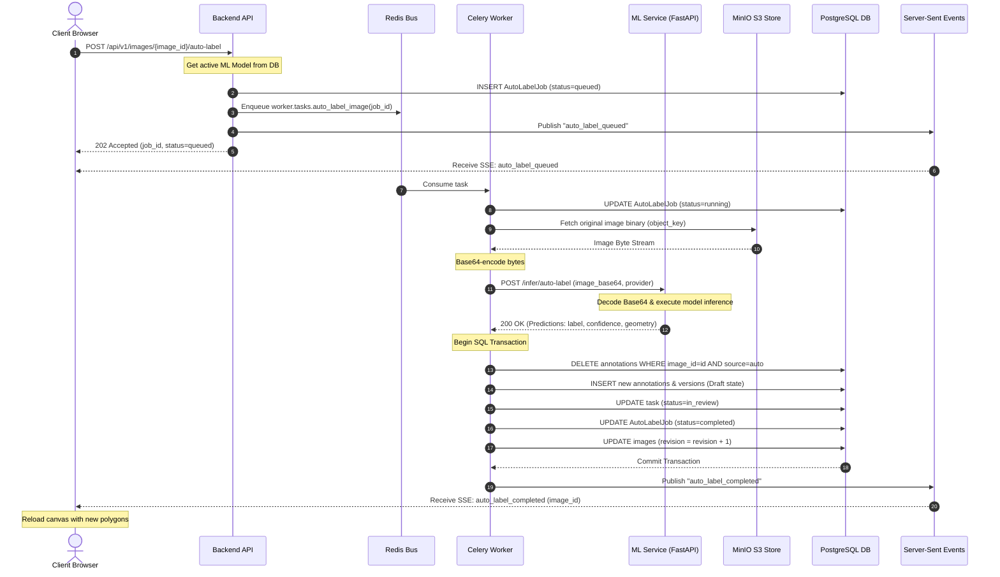

# Asynchronous Auto-Label Pipeline

This guide outlines the step-by-step asynchronous execution flow for the AI-assisted auto-labeling pipeline inside PixelQueue.

---

## 🔄 Detailed Execution Flow

The sequence of operations spanning the Client, Backend API, Redis Broker, Celery Worker, ML Service, and MinIO S3 bucket is illustrated below:

---

## 🛠️ Step-by-Step Operations Tracing

### Step 1: Triggering the Job
When the user clicks the "Auto-Label" button in the canvas workspace, the frontend checks the current task status and requests auto-labeling:
*   **Request**: `POST /api/v1/images/{image_id}/auto-label`
*   **API Action**:
    1.  Verifies the user has at least an `annotator` role.
    2.  Queries `ml_models` to fetch the active model configuration.
    3.  Generates a job UUID and inserts an `AutoLabelJob` record with `status = "queued"`.
    4.  Pushes the job ID to the Redis message bus via `celery_app.send_task("worker.tasks.auto_label_image", args=[job_id])`.
    5.  Publishes the `auto_label_queued` SSE event.
    6.  Returns `202 Accepted` to the client.

### Step 2: Worker Initialization
A Celery worker node retrieves the task from Redis:
*   **API Action**: The worker starts a DB session, queries the `AutoLabelJob` by ID, updates its status to `running`, and commits.
*   **S3 Fetch**: The worker fetches the raw image bytes from MinIO via `get_object_bytes(image.object_key)`.

### Step 3: ML Inference
The worker base64 encodes the image bytes and calls the ML microservice:
*   **Request**: `POST {settings.ml_service_url}/infer/auto-label`
*   **ML Service Action**:
    1.  Decodes the base64 string to BGR image pixels using OpenCV.
    2.  Invokes PyTorch to run the YOLO segmenter.
    3.  If YOLO fails or has no predictions, falls back to OpenCV contour detection (`cv_fallback`).
    4.  Returns predicted categories, confidence metrics, and coordinate points (GeoJSON format).

### Step 4: Database Synchronization (Bulk Insert)
The worker receives the prediction list and runs a PostgreSQL transaction:
*   **Cleanup**: Deletes previous auto-label annotations on that image to prevent coordinate duplication.
*   **Insert**: Creates new `Annotation` and `AnnotationVersion` records in `draft` status.
*   **Optimization**: Generates UUIDs in-memory using `uuid4()` before calling `db.add()`, avoiding nested flush database roundtrips.
*   **Revision Update**: Increments the `annotation_revision` column on the `Image` record to keep cache state aligned.
*   **Task State**: Sets the matching `Task` status to `in_review` so reviewers can access it.
*   **Job Complete**: Updates `AutoLabelJob` to `completed` and commits the transaction.

### Step 5: Frontend Update
*   **SSE Notify**: The worker calls `publish_project_event` to write an `auto_label_completed` message.
*   **Browser Canvas Reload**: The browser's event stream handler receives the message. If the completed `image_id` matches the active image in `useAnnotationStore`, the canvas triggers a clean fetch request (`GET /api/v1/images/{image_id}/annotations`), scales coordinates, and renders the polygons.
