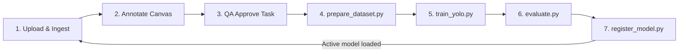

# MLOps Scripts Suite

PixelQueue contains an endogenous MLOps script suite inside the `/scripts` directory to bridge the gap between human-approved annotations and production models.

---

## 🔄 End-to-End MLOps Workflow

The training and deployment loop runs through these script stages:



---

## 🛠️ Script Inventory & Documentation

### 1. Database Bootstrapper (`bootstrap_data.py`)
Seeds local environments with demo accounts and initial model records.
*   **Action**:
    *   Registers default user accounts (`admin@example.com`, `reviewer@example.com`, `annotator@example.com`).
    *   Creates a default project: `"Bootstrapped Annotation Project"`.
    *   Inserts the initial active model `yolov8n-seg` record into the database.
*   **Execution**:
    ```bash
    docker compose --profile tools run --rm bootstrap
    ```

### 2. Dataset Compiler (`prepare_dataset.py`)
Pulls raw annotations and image binaries, formats them for YOLO training, and splits them into training and validation subsets.
*   **Action**:
    *   Queries `postgres` to fetch all annotations marked as `approved` (ground-truth).
    *   Uses a split ratio (default: 20% validation) based on a UUID hash split algorithm to assign images to `train` or `val` sets.
    *   Downloads source images from MinIO.
    *   Generates a normalized YOLO coordinates text file for each image.
    *   Outputs results to `/tmp/dataset/images/{train|val}` and `/tmp/dataset/labels/{train|val}`.
    *   Generates a `dataset.yaml` metadata file.
*   **Execution**:
    ```bash
    python scripts/prepare_dataset.py
    ```

### 3. Model Fine-Tuner (`train_yolo.py`)
Fine-tunes a pre-trained YOLO segmentation model using the generated dataset.
*   **Action**:
    *   Reads the `dataset.yaml` metadata file.
    *   Invokes Ultralytics YOLO to train on `device="cpu"` (to ensure offline safety and local compatibility).
    *   Saves the best weights artifact as `model.pt` in `/tmp/training/`.
    *   Generates a `train_report.json` execution summary.
    *   *Offline Fallback*: If Ultralytics package is missing or fails, writes a placeholder mock weight file to prevent crashes.
*   **Execution**:
    ```bash
    # Configure variables via environment variables
    export BATCH=4
    export EPOCHS=10
    python scripts/train_yolo.py
    ```

### 4. Metrics Evaluator (`evaluate.py`)
Computes dataset density, distribution metrics, and balance scores.
*   **Action**:
    *   Reads the compiled dataset summary.
    *   Calculates **Annotation Density** ($\text{annotations} / \text{images}$).
    *   Calculates **Class Balance Score** (deviation from mean representation).
    *   Writes performance metrics to `/tmp/evaluation.json`.
*   **Execution**:
    ```bash
    python scripts/evaluate.py
    ```

### 5. Model Registry (`register_model.py`)
Registers the trained weights in the ML service registry and activates them in the system.
*   **Action**:
    *   Sanitizes the model weights filename.
    *   Uploads the `model.pt` binary directly to MinIO under `models/{name}/{version}/model.pt`.
    *   Sets all old database model records to `is_active = False`.
    *   Inserts the new model record into `ml_models` with `is_active = True`, binding training reports and evaluation metrics to the record.
*   **Execution**:
    ```bash
    export MODEL_VERSION="1.3.0"
    python scripts/register_model.py
    ```
