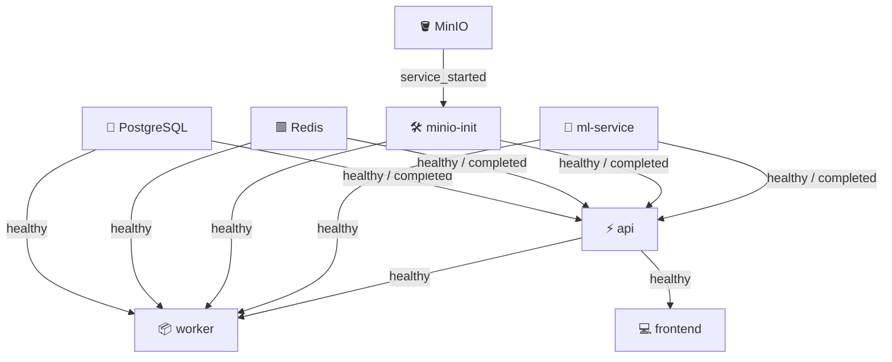

# Docker Compose Deployment Guide

This guide documents the service orchestrations, container dependencies, health check validations, and volume configurations defined in PixelQueue's `docker-compose.yml` file.

---

## 🏗️ Services & Port Maps

PixelQueue uses Docker Compose to coordinate the local environment across 8 services:

| Service Container | Internal Port | Host Mapped Port | Dependency Condition | Purpose |
|---|---|---|---|---|
| `frontend` | `80` | `5173` | `api` healthy | React SPA application served via Nginx. |
| `api` | `8000` | `8000` | `postgres`/`redis` healthy, `minio-init` successful | FastAPI application server. |
| `worker` | — | — | `api` healthy | Celery task processor. |
| `ml-service` | `8002` | `8002` | — | PyTorch YOLOv8 & OpenCV inference service. |
| `postgres` | `5432` | `5432` | — | PostgreSQL database. |
| `redis` | `6379` | `6379` | — | Celery task message broker. |
| `minio` | `9000` / `9001` | `9000` / `9001` | — | S3 object storage server & web console. |
| `minio-init` | — | — | `minio` started | MC script to create default buckets. Runs once and exits. |

---

## 🔄 Startup Dependencies & Order

Services boot up using strict `depends_on` conditions rather than starting concurrently. This guarantees that databases and queues are initialized before dependent code runs.



---

## 🏥 Health Check Configurations

Each persistent service declares a `healthcheck` routine inside the Compose manifest. If a health check fails, dependent services are blocked from starting.

### 1. PostgreSQL (`postgres`)
Runs the postgres client status check.
*   **Command**: `pg_isready -U ${POSTGRES_USER} -d ${POSTGRES_DB}`
*   **Settings**: Evaluates every 5s, timeout 5s, retries 20 times.

### 2. Redis (`redis`)
Pings the Redis CLI.
*   **Command**: `redis-cli ping`
*   **Settings**: Evaluates every 5s, timeout 3s, retries 20 times.

### 3. ML Service (`ml-service`)
Pings the custom health endpoint.
*   **Command**: `curl -fsS http://localhost:8002/healthz || exit 1`
*   **Settings**: Evaluates every 10s, timeout 3s, retries 20 times.

### 4. API Backend (`api`)
Pings the core backend ready status.
*   **Command**: `curl -fsS http://localhost:8000/readyz || exit 1`
*   **Settings**: Evaluates every 10s, timeout 3s, retries 20 times.

---

## 🗄️ Volumes & Persistence

PixelQueue preserves database records and image binaries using named Docker volumes:

1.  **`postgres_data`**: Mapped to `/var/lib/postgresql/data`. Persists all PostgreSQL database tables, schemas, and configurations.
2.  **`minio_data`**: Mapped to `/data`. Holds the raw upload binaries, segmentation weights, and generated ZIP archives.

*To wipe clean all persistent storage and reset the DB to seed levels, execute:*
```bash
docker compose down -v
```
*(The `-v` flag deletes all associated named volumes).*

---

## ⚖️ Horizontal Worker Scaling

Because auto-labeling and export tasks execute asynchronously, you can easily scale worker instances horizontally to balance execution loads:

```bash
# Spin up 3 Celery worker containers running in parallel
docker compose up -d --scale worker=3
```
The Redis message bus will automatically balance tasks round-robin across all healthy worker instances.

---

## 🛠️ Overriding Configurations

To adjust configurations without altering the base `docker-compose.yml` file, create a `docker-compose.override.yml` file at the root directory.

For example, to map the PostgreSQL server to port `5433` locally:
```yaml
version: '3.8'

services:
  postgres:
    ports:
      - "5433:5432"
```
Compose merges this file automatically on startup.
